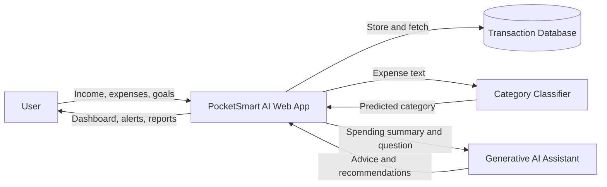

# Data Flow Diagram

| Team ID | Project Title | Team Size | Team Leader |
| --- | --- | --- | --- |
| SWTID-2026-9211 | PocketSmart AI: Your Smart Budget & Recommendation Assistant | 5 | Sivapriya S |

## Data Flow Diagram (Level 0 and Level 1)

## Data Flow Description

| Flow ID | Source | Data | Process | Destination |
| --- | --- | --- | --- | --- |
| DF-1 | User | Income, budget limits, savings goal | Profile and budget setup | User Profile Store |
| DF-2 | User | Expense amount, date, description | Add expense | Transaction Database |
| DF-3 | Transaction Database | Expense description | Automatic categorisation | Category Classifier |
| DF-4 | Category Classifier | Predicted category | Update transaction | Transaction Database |
| DF-5 | Transaction Database | Monthly totals per category | Budget check and alert generation | User (alerts) |
| DF-6 | Transaction Database | Spending summary | Recommendation generation | Generative AI Assistant |
| DF-7 | Generative AI Assistant | Saving tips and answers | Present advice | User |
| DF-8 | Transaction Database | Monthly data | Report generation | User (dashboard / CSV) |

## User Stories

| User Type | Functional Requirement (Epic) | User Story Number | User Story / Task | Acceptance Criteria | Priority | Release |
| --- | --- | --- | --- | --- | --- | --- |
| Customer (Web User) | Registration and Login | USN-1 | As a user, I can register and log in so that my data stays private | Account is created and login works with valid credentials | High | Sprint-1 |
| Customer (Web User) | Profile and Budget Setup | USN-2 | As a user, I can enter my income, monthly budget and goal | Values are saved and shown on the dashboard | High | Sprint-1 |
| Customer (Web User) | Expense Tracking | USN-3 | As a user, I can add an expense quickly | Expense appears in the list with date and amount | High | Sprint-1 |
| Customer (Web User) | Auto Categorisation | USN-4 | As a user, I want expenses categorised automatically | Category is predicted and can be edited | High | Sprint-2 |
| Customer (Web User) | Budget Alerts | USN-5 | As a user, I get an alert when I near my category limit | Alert shows at 80% and 100% of the limit | High | Sprint-2 |
| Customer (Web User) | Dashboard | USN-6 | As a user, I can view charts of my spending | Category and monthly charts are displayed | Medium | Sprint-3 |
| Customer (Web User) | AI Recommendations | USN-7 | As a user, I get personalised saving suggestions | At least 3 relevant tips are shown per month | High | Sprint-3 |
| Customer (Web User) | AI Assistant | USN-8 | As a user, I can ask questions about my money | Assistant replies using my spending data | Medium | Sprint-3 |
| Customer (Web User) | Goal Planner | USN-9 | As a user, I can set a savings goal and see progress | Monthly saving needed and progress bar are shown | Medium | Sprint-4 |
| Customer (Web User) | Reports | USN-10 | As a user, I can export my monthly report | CSV file downloads with correct data | Low | Sprint-4 |
