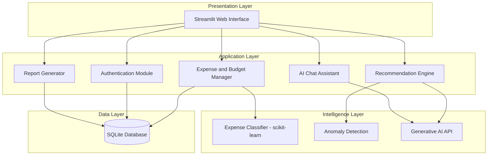

# Solution Architecture

| Team ID | Project Title | Team Size | Team Leader |
| --- | --- | --- | --- |
| SWTID-2026-9211 | PocketSmart AI: Your Smart Budget & Recommendation Assistant | 5 | Sivapriya S |

## Solution Architecture

## Architecture Components

| Layer | Component | Technology | Responsibility |
| --- | --- | --- | --- |
| Presentation | Web Interface | Streamlit, Plotly | Forms, dashboard charts, chat window |
| Application | Authentication Module | Python, hashed passwords | Register and log in users securely |
| Application | Expense and Budget Manager | Python, pandas | Add expenses, apply budgets, raise alerts |
| Application | Recommendation Engine | Python, rules and LLM prompts | Generate saving tips and alternatives |
| Application | AI Chat Assistant | Generative AI API | Answer money questions using user data |
| Application | Report Generator | pandas, CSV | Monthly summary and export |
| Intelligence | Expense Classifier | scikit-learn (TF-IDF and Logistic Regression) | Predict category from description |
| Intelligence | Anomaly Detection | scikit-learn (Isolation Forest) | Flag unusual spending |
| Data | Database | SQLite | Store users, transactions, budgets, goals |
